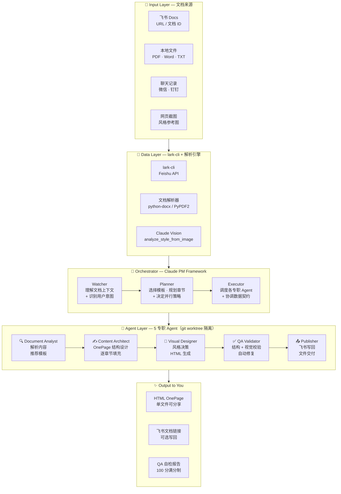
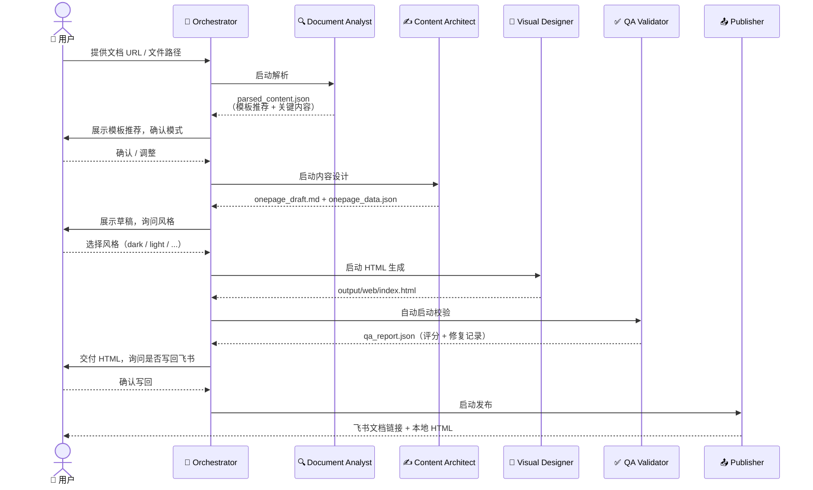
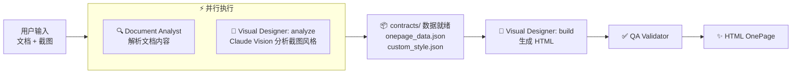

# doc-to-onepage · Multi-Agent Skill

> 将任意文档转化为**可决策的一页纸（OnePage）**，并生成可直接汇报的网页。  
> 帮你把"信息"变成"说服力"。

这是一个基于 **Claude PM Framework 多 Agent 架构**的 Claude Code Skill，由 5 个专职 Agent 协作完成文档到网页的全链路转化。

---

## 整体架构



---

## 工作流程

### 标准流程（仅提供文档）



### 加速流程（同时提供文档 + 风格截图）



> 并行执行可节省约 **40-60%** 的等待时间。

---

## Agent 职责速查

| Agent | claude-pm 角色 | Git Worktree | 输入 | 输出 | 核心脚本 |
|-------|--------------|-------------|------|------|---------|
| 🔍 Document Analyst | Researcher | `doc-to-onepage-analyst` | 文档 URL / 文件 | `parsed_content.json` | `read_lark_doc.py` · `recommend_template.py` |
| ✍️ Content Architect | Architect | `doc-to-onepage-architect` | `parsed_content.json` | `onepage_draft.md` · `onepage_data.json` | `generate_onepage.py` · `export_onepage_json.py` |
| 🎨 Visual Designer | UI/UX | `doc-to-onepage-designer` | `onepage_data.json` + 风格 | `output/web/index.html` | `build_web_onepage.py` · `analyze_style_from_image.py` |
| ✅ QA Validator | QA | `doc-to-onepage-qa` | HTML 文件 | `qa_report.json` | `validate_onepage.py` · `screenshot_validator.py` |
| 📤 Publisher | DevOps | `doc-to-onepage-publisher` | HTML + Markdown | `delivery.json` | `create_lark_doc.py` · `deploy_web.py` |

---

## 数据契约流

各 Agent 通过 `contracts/` 目录传递数据，实现**严格的职责边界**：

```
文档输入
  └─► [Document Analyst]
          └─► contracts/parsed_content.json
                  └─► [Content Architect]
                          ├─► contracts/onepage_draft.md
                          └─► contracts/onepage_data.json
                                  └─► [Visual Designer]
                                          └─► output/web/index.html
                                                  └─► [QA Validator]
                                                          └─► contracts/qa_report.json
                                                                  └─► [Publisher]
                                                                          └─► contracts/delivery.json
```

截图同时提供时，`contracts/custom_style.json` 由 Visual Designer:analyze 与 Content Architect **并行生成**。

---

## 核心能力

### 输入支持

| 类型 | 处理方式 |
|------|----------|
| 飞书文档 URL | `lark-cli docs +fetch` 读取，`+media-download` 下载图片 |
| Word (.docx) | python-docx 解析 |
| PDF | PyPDF2 提取 |
| 聊天记录 | 微信 / 钉钉 / 通用格式 |
| Markdown / TXT | 直接读取 |
| 网页截图 | Claude Vision 分析风格并复现 |

### 两种生成模式
- **OnePage 重构**（默认）：结论优先、信息压缩、汇报增强，适合对内容做结构化重组
- **保留原文结构**：用户说"直接用原文档"时，按原有章节生成网页，不强制套模板

### 10 种内容模板

`decision-report` / `product-solution` / `project-progress` / `governance-improvement` / `holiday-support` / `product-tool` / `project-management` / `team-intro` / `personal-review` / `cartoon-brochure` / `blackboard-notice`

> 其中 `cartoon-brochure`（卡通宣传册）和 `blackboard-notice`（黑板报公告）为新增专题模板。

### 12 种视觉风格

**基础风格**

| 风格 | 适用场景 | 视觉特点 |
|------|----------|----------|
| `dark` | 高层汇报、产品评审 | 暗色 + 毛玻璃 + 彩色光晕 |
| `light` | 日常周报、团队分享 | 白色背景 + 淡灰卡片 |
| `corporate` | 正式决策、跨部门 | 深蓝顶部 + 严谨排版 |
| `warm` | 团队介绍、项目复盘 | 米色 + 暖棕色调 |

**创意风格（物理隐喻）**

| 风格 | 视觉特点 |
|------|----------|
| `blueprint` | 蓝图网格 + 等宽字体，像建筑图纸 |
| `retro` | 高饱和色块 + 粗黑边框，活泼易传播 |
| `folder` | 蓝色文件夹 + 彩色标签页，专业有序 |
| `receipt` | 热敏纸质感 + 虚线分隔，简洁高效 |
| `scrapbook` | 牛皮纸 + 便签拼贴 + 红色图钉 |
| `dossier` | 软木板 + 金属夹 + URGENT 标签 |

**专题风格**

| 风格 | 视觉特点 |
|------|----------|
| `cartoon` | 天蓝渐变 + CSS 云朵 + 彩色卡片 + 弹跳动画，适合宣传册 |
| `blackboard` | 深墨绿黑板 + 粉笔质感 + 功能色竖线 + ★公告栏★装饰，适合公告通知 |

### 智能版式系统（NEW）

子项和章节级的自动排版，打破"一条一条往下排"的单调节奏：

| 场景 | 版式 | 效果 |
|------|------|------|
| 2 个子项 | 两列等宽 | 左右对比 |
| 3 个子项 | 三列等宽 | 并列展示 |
| 4+ 个子项 | 2×N 等高网格 | 紧凑矩阵 |
| 相邻两个轻量章节 | 卡片双列并排 | 宽窄交替，节奏变化 |

**关键规则**：同行格子强制等高（`align-items: stretch`），移动端全部退为单列。

### 视觉交互增强（NEW）

| 特性 | 说明 |
|------|------|
| 3D 倾斜 | 鼠标悬停时卡片产生 `perspective` + `rotateXY` 倾斜，配合光泽跟随效果 |
| 内联进度条 | 加粗百分比（如 **41%**）自动追加 56px 迷你进度条 |
| 数字滚动 | Metric 大数卡片从 0 滚动到目标值 |
| 背景视差 | dark 主题下光晕随滚动轻微偏移 |
| 标题渐变动画 | dark 主题标题文字四色渐变循环 |
| 悬停彩条 | 卡片左侧 accent 条在悬停时从 4px 扩宽到 6px |
| 结论脉冲 | 结论区持续发出柔和的 `box-shadow` 脉冲 |

### 图标自动匹配

40+ 中文业务关键词自动映射为 emoji 前缀：

> 目标→🎯　保障→🛡️　赔付→💸　应急→🚨　人力→👥　数据→📊　风险→⚠️　服务→🔧　激励→🏆 …

### 6 种自动识别可视化组件

无需手动配置，自动检测内容类型并渲染：

| 组件 | 触发条件 |
|------|----------|
| Metric 大数卡片 | 文本含 2+ 个 `**数字%**` |
| Flow 流程图 | 有序列表（1. 2. 3.） |
| Journey 旅程线 | 含旅程关键词的无序列表 |
| Priority Badge | 表格中含独立的 P00/P0/P1 |
| Risk Level | 表格含风险等级 + 高/中/低 |
| CTA 决策框 | 结论区的 `**问句？**` |

### 图片支持

飞书文档中的图片通过 `lark-cli docs +media-download` 下载后，构建时自动以 **base64 内嵌**到 HTML，生成的网页是完全自包含的单文件，可直接分享。

### 质量自检（满分 100）

| 检查项 | 权重 | 说明 |
|--------|------|------|
| 结论优先 | 20 | 首屏可见结论区域 |
| CTA 行动号召 | 20 | 有明确的决策问题 |
| 风险说明 | 15 | 包含风险与依赖 |
| 模块数量 | 15 | 核心模块 ≤ 8 个 |
| 视觉层级 | 15 | 清晰的字号 / 颜色区分 |
| 内容长度 | 15 | HTML < 80KB，无信息过载 |

支持 `--lenient` 宽松模式（保留原文结构时跳过结构性检查，只校验视觉质量）。

---

## Agent 状态监控

```bash
# 一次性快照
python3 scripts/agent_status.py

# 实时 Live 仪表盘（每 2 秒刷新，支持并行可视化）
python3 scripts/agent_watch.py
```

示例输出：
```
  doc-to-onepage — Agent Status  (14:32:10)
  ──────────────────────  ────────────  ──────────────────  ──────────────────
  Agent                   Role          Status              Current Activity
  ──────────────────────  ────────────  ──────────────────  ──────────────────
  🔍 Document Analyst     Researcher    ✅ Done             所有输出已生成
  ✍️ Content Architect    Architect     🔵 Working          ⠴ onepage_data.json
  🎨 Visual Designer      UI/UX         ⚪ Idle             等待任务
  ✅ QA Validator         QA            ⚪ Idle             等待任务
  ──────────────────────  ────────────  ──────────────────  ──────────────────
  总计 5 个 Agent  |  ✅ Done: 1  |  🔵 Working: 1  |  ⚪ Idle: 3
```

---

## 安装

```bash
# 在 Claude Code 中执行
/plugin install github:yingyinyin666/doc-to-onepage-Multi-Agent-Skill
```

安装后，向 Claude 发送文档链接或文件路径即可触发。

### 环境依赖

```bash
# 文档解析（按需安装）
pip install PyPDF2 python-docx

# 飞书集成（可选）
npm install -g @larksuite/cli
lark-cli config init --new
lark-cli auth login

# 图片风格逆推（需要 Anthropic API Key）
pip install anthropic
export ANTHROPIC_API_KEY=sk-ant-xxx

# 截图校验（可选）
pip install playwright && playwright install chromium
```

---

## 脚本说明

| 脚本 | 功能 |
|------|------|
| `build_web_onepage.py` | 核心：生成 HTML 网页，12 种风格 + 多列版式 + 图片 base64 内嵌 |
| `recommend_template.py` | 基于关键词智能推荐模板（含 cartoon-brochure / blackboard-notice） |
| `analyze_style_from_image.py` | 图片风格逆推（Claude Vision） |
| `export_onepage_json.py` | 将 OnePage Markdown 解析为结构化 JSON |
| `generate_onepage.py` | 从模板生成 OnePage 初稿 |
| `validate_onepage.py` | 质量自检 + 自动修复，支持 `--lenient` 宽松模式 |
| `read_lark_doc.py` | 读取飞书文档（需 lark-cli 已登录） |
| `create_lark_doc.py` | 创建/更新飞书文档（可选步骤） |
| `screenshot_validator.py` | Playwright 截图视觉校验（可选） |
| `agent_status.py` | Agent 状态快照 |
| `agent_watch.py` | 实时监控仪表盘 |

---

## 项目结构

```
doc-to-onepage/
├── SKILL.md               # Orchestrator 行为指南 + 网页质量原则(A-N)
├── CLAUDE.md              # Claude PM Framework 配置
├── agents/                # 5 个 Agent 角色定义
│   ├── document-analyst.md
│   ├── content-architect.md
│   ├── visual-designer.md
│   ├── qa-validator.md
│   └── publisher.md
├── contracts/             # Agent 间数据契约（运行时生成）
├── docs/                  # 项目文档
│   ├── PROJECT.md
│   ├── WORKFLOW.md
│   ├── TOOLCHAIN.md
│   └── INSTRUCTIONS.md
├── scripts/               # 功能脚本
│   ├── build_web_onepage.py        # 核心：HTML 生成（12风格 + 智能版式）
│   ├── recommend_template.py       # 模板推荐
│   ├── analyze_style_from_image.py # 图片风格逆推
│   ├── agent_status.py             # Agent 状态快照
│   ├── agent_watch.py              # 实时监控仪表盘
│   ├── validate_onepage.py         # 质量自检 + 修复
│   └── ...
├── trackdown/
│   └── BACKLOG.md         # TrackDown 工作项
└── reference/             # API 文档 + 模板说明
```

---

## License

MIT
